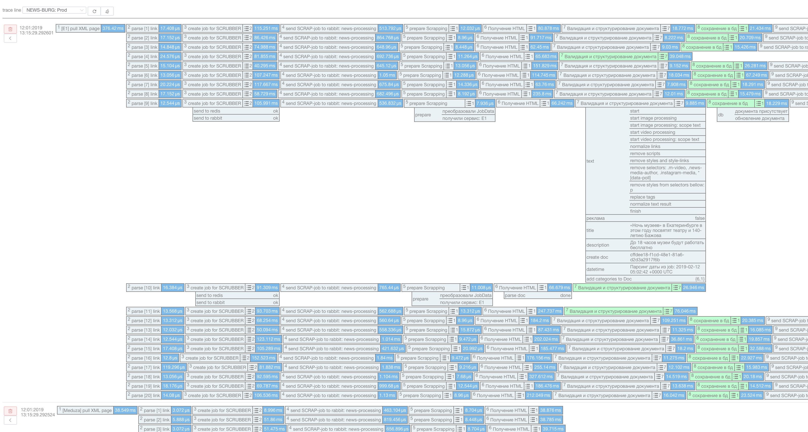

[](https://travis-ci.org/efureev/tracefall)
[](https://travis-ci.org/efureev/tracefall)
[](https://codeclimate.com/github/efureev/tracefall/maintainability)
[](https://codeclimate.com/github/efureev/tracefall/test_coverage)
[](https://goreportcard.com/report/github.com/efureev/tracefall)
[](https://codecov.io/gh/efureev/tracefall)

## Info
Package for sending logs to the storage, for the subsequent withdrawal of the traceViewer service and display there.

Supported storage drivers:  
- [x] Console // invalid realisation
- [x] Postgres // invalid realisation
- [ ] Algolia
- [ ] ElasticSearch 

## Content
- Thread Line: Line of logs. Contains Logs. Thread ID = First root Log ID 
- Log: data node. May contents other Logs as children

## ScreenShort of TraceViewer based on traceFall


## Union Logs
Independent Logs may union to one log thread via `LogParentShadow`
```go
logChild := tracefall.NewLog(`prepare Scrapping`).SetApplication(`micro.1`)
logChild.ParentFromShadow(job.LogShadow)
```
#### Example
`microservice #1`
```go
logParent := tracefall.NewLog(`Start`)
// send to RabbitMQ job with logParent.ToShadow() data
```
`microservice #2`
```go
// get from RabbitMQ job with logParent.ToShadow() data
logChild := tracefall.NewLog(`prepare Scrapping`).SetApplication(`micro.2`)
logChild.ParentFromShadow(job.LogShadow)
```
Now `logChild` has parent `logParent`

## Use

**Create new Log node**
```go
import "github.com/efureev/tracefall"
// ...
log := tracefall.NewLog(`test log`)
```

**Finish log**
```go
log := tracefall.NewLog(`test log`)

// with fail result
log.Fail(err error)

// with success result 
log.Success()

// without result: set finish time of the log
log.FinishTimeEnd()

```
**Finish thred of logs**
```go
log.ThreadFinish()
```

**Add extra data to Log**
```go
log := tracefall.NewLog(`test log`)
log.Data.Set(`url`, `http://google.com`).Set(`service`, service.Name)
```

**Add notes to Log**
```go
log.Notes.Add(`send to redis`, `ok`).Add(`send to rabbit`, `ok`)
//or
log.Notes.AddGroup(`send to redis`, [`ping`,`processing`,`done`])
```


**Sending logs to storage**
```go
var logStorage *tracefall.DB
func tracerLogStart(tracerHost, tracerUser, tracerPassword, tracerDbName, tracerTable string) {
	var err error

	logStorage, err = tracefall.Open(`postgres`, postgres.GetConnParams(tracerHost, tracerDbName, tracerTable, tracerUser, tracerPassword))
	if err != nil {
		log.Fatal(err)
	}
}
func send(m) {
	if logStorage == nil {
        return
    }
	_, err := logStorage.Send(m *tracefall.Log)
    if err != nil {
        fmt.Println(`[error sent to trace logs] -> ` + err.Error())
    }
}

```

